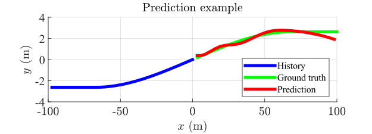

# Model Predictive Control of Autonomous Vehicles Incorporating Trajectories Predicted by Deep Learning (DL-MPC)

**Author:** Zengjie Zhang (z.zhang3@tue.nl), Ni Dang (ni.dang@tum.de)

A demonstration of controlling an ego autonomous vehicle incorporating the target vehicle trajectory predicted by a recurrent neural network. For more details, refer to our ArXiv article at [https://arxiv.org/pdf/2310.02843](https://arxiv.org/pdf/2310.02843).


## Quick Guide

### Scenario of demonstration

This demonstration considers a highway scenario where an agent-driving ego vehicle moves along the central lane while avoiding collisions with a human-driving target vehicle cutting in from the slow lane, as shown in **Fig. 1**. A **recursive neural network** with **long short-term memory (LSTM)** units is trained to predict the trajectory of the target vehicle according to its historical trajectories. Based on the predicted trajectory, a **model predictive control (MPC)** is used to allow safe maneuvering for the ego. **Fig. 1** showcases the resulting trajectories of both vehicles. **Fig. 1** is an example of trajectory prediction.

**Note**: for the current version, the target vehicle is hardcoded using an 'S' shape spline.


**Fig 1. the highway driving scenario.**



**Fig 2. prediction example of the target vehicle trajectory.**

### Environment Requirements

 - **Windows**: tested on 11 but compatible in general
 - **CUDA** *(Optional)*: tested on 12.2
 - **MATLAB**: tested on R2022b but compatible in general
    - **Deep Learning Toolbox**: version 14.5
    - **Parallel Computing Toolbox** *(Optional)*: version 7.7

### File Structure

The files are organized as the following structure:
```
README.md                   % This read-me file
LICENSE                     % The license file
main.m                      % The main code script
config/
    param.m                 % The script to render parameters
libs/
    controller              % Functions related to control
    collision               % Functions related to collision detection
    draw                    % Functions related to visualization
    training                % Functions related to predictor training
```


### Quick Run

- Run the main script `main.m`;
- The rnn predictor and its training information will be saved in `policy/`;
- The control results will be saved in `data/`;
- All figures will be saved in `figures/`.

